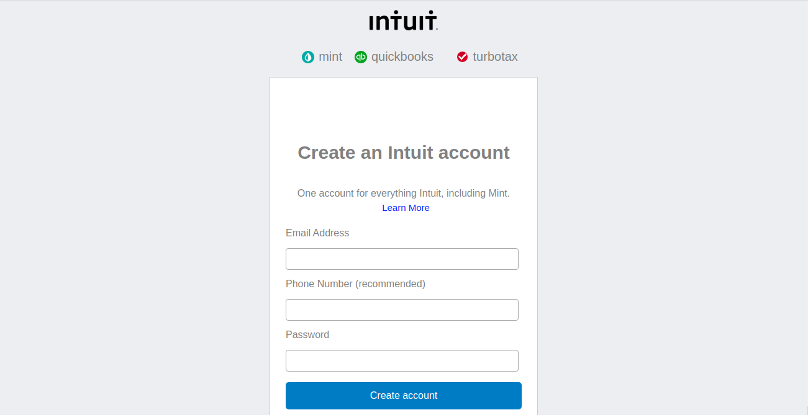

# HTML-Forms
The goal of  this project,is yo rebuild the form used by Mint.com for signing up new users. They have been highly praised for the design and simplicity of their site, and their signup process is very clean.
[Mint](http://www.mint.com/)

## Screenshot

 

## Technologies

- HTML 
- CSS

## Live Demo

[Live Demo Link](https://raw.githack.com/kobiyoyo/HTML-Forms/master/index.html)

## Authors

👤 **Adama Chubiyojo Desmond**

-  [Github](https://github.com/kobiyoyo)
-  [Twitter](https://twitter.com/_kobiyoyo)
-  [Linkedin](https://www.linkedin.com/in/chubiyojo-adama/)
-  [Email](adamachubi@gmail.com)

👤 **Danilo Zagarcanin**

- [Github](https://github.com/danilozag1992)
- [Twitter](https://twitter.com/danilo96061514)
- [Linkedin](https://www.linkedin.com/in/danilo-zagarcanin-88169b185/)
- [Email](danilozagarcanin@gmail.com)

## 🤝 Contributing

Contributions, issues and feature requests are welcome!

Feel free to check the [issues page](issues/).

## Show your support

Give a ⭐️ if you like this project!

## Acknowledgments

- Hat tip to anyone whose code was used
- Inspiration
- etc

## 📝 License

This project is [MIT](lic.url) licensed.
